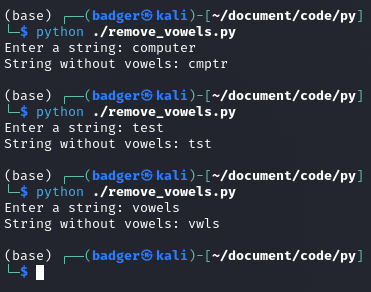

# Vowelless Language Program

This program removes the vowels from a given string.
> TODO: Calculate the ease of deduction for the word, based on how many characters and vowels the word has. Like how easy it would be to infer the word based on the word without it's vowels.

## Usage



To use the program, simply run the following command:


```sh
python ./remove_vowels.py <word>
```

where `<word>` is the string that you want to remove the vowels from.

---

```sh
python ./remove_vowels.py
```

where you will then be prompted what the word is that you would like to remove the vowels of.

## Example

The following example shows how to use the program to remove the vowels from the string "hello":

```
python ./remove_vowels.py "hello"
```

This will output the following string:

`hll`

## Vowel-less Language

A vowel-less language is a language that does not have any vowels. This means that all of the words in the language are made up of only consonants.

There are a few real-world examples of vowel-less languages. One example is `Kabardian`, a language spoken in the `North Caucasus region of Russia`. Kabardian has no vowels, and all of the words in the language are made up of only consonants.

Another example of a vowel-less language is `Rotokas`, a language spoken in the `Solomon Islands`. Rotokas has only five vowels, and all of the other words in the language are made up of only consonants.

Vowel-less languages can be difficult to learn for speakers of languages that have vowels. This is because vowels are essential for distinguishing between words. However, vowel-less languages can also be easier to produce, as they do not require speakers to use their vocal cords in a specific way.